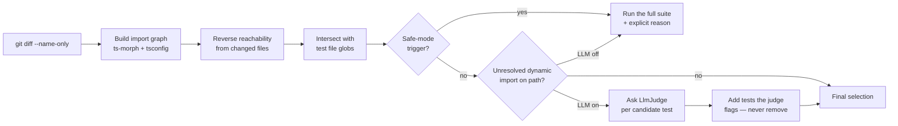

# smart-test-select

[](https://github.com/tsvirov/smart-test-select/actions/workflows/ci.yml)
[](./LICENSE)


> Instead of running the whole suite on every PR, analyze the diff's dependency graph and propose the minimal set of tests actually at risk — with an LLM fallback for dynamic-import edge cases the static graph can't resolve.

**Stop running 100% of your tests for a 2% diff.**

## Try it in 60 seconds

```bash
git clone https://github.com/tsvirov/smart-test-select.git
cd smart-test-select
npm ci && npm run build
bash examples/demo.sh
```

That builds the CLI and runs it against a real fixture repo. Real output (also in
[`examples/README.md`](./examples/README.md)):

```
--- Scenario 1: change src/a.ts, a file used by 5 of the 8 tests ---
5 of 8 tests affected:
  tests/a.test.ts -> src/a.ts
  tests/b.test.ts -> src/b.ts -> src/a.ts
  tests/barrel.test.ts -> src/barrel.ts -> src/a.ts
  tests/literalDynamic.test.ts -> src/literalDynamic.ts -> src/a.ts
  tests/typesOnly.test.ts -> src/a.ts

--- Scenario 2: also touch tsconfig.json -> safe mode, run everything ---
safe mode — running the full suite (8 tests)
  - tsconfig.json changed — running the full suite
```

## The problem

A typical PR touches a handful of files — often well under 5% of the repository — yet CI runs
100% of the test suite on every push, because that's the only way to be sure nothing broke. On a
suite that takes 10 minutes, that's 10 minutes spent re-verifying code the diff never touched, on
every single PR, all day.

## How it works



1. `sts` gets the changed files from `git diff --name-only <base>...HEAD` (an injectable exec
   function, never called directly in tests).
2. It builds a static import graph of the project with [ts-morph](https://ts-morph.com/), using
   the real TypeScript module resolver — so `tsconfig.json` `paths` aliases resolve exactly like
   they would for the compiler.
3. From each changed file it walks the graph **backwards** (who imports this, who imports those,
   …) to find every file that transitively depends on it.
4. It intersects that set with your test file glob (`**/*.{test,spec}.{ts,tsx,js,jsx}` by
   default) — that's your candidate selection.
5. Before trusting it, it checks a list of safe-mode triggers (config files changed, a changed
   file that isn't a graph node, the graph failing to build, or an unresolved dynamic import on
   the reachability path). Any trigger means: run the whole suite, with the reason printed, not a
   silently narrowed run.
6. If an LLM fallback is configured, each unresolved dynamic `import()`/`require()` on the path is
   handed to an `LlmJudge`, which can only **add** tests to the static selection — it never
   removes one the graph already found.

## Before / after

From the demo fixture repo: 8 tests total, 1 file changed (`src/a.ts`).

| | Tests run |
|---|---|
| Naive CI (run everything) | 8 / 8 |
| `smart-test-select` | 5 / 8, with the exact reason chain for each |

## Install

```bash
npm install --save-dev smart-test-select
```

## CLI usage

```bash
sts select --base main [--json] [--runner-args "npx vitest run"] [--llm-base-url <url> --llm-model <model>]
sts graph [--stats]
sts explain <testfile> [--base main]
```

| Command | Flag | Default | What it does |
|---|---|---|---|
| `select` | `--base <ref>` | `main` | git ref to diff against |
| `select` | `--json` | off | print machine-readable JSON instead of text |
| `select` | `--runner-args <cmd>` | — | test runner command to prefix the selection with, e.g. `"npx vitest run"` |
| `select` | `--llm-base-url <url>` | — | enable the LLM fallback via any OpenAI-compatible endpoint — including a local Ollama server: `--llm-base-url http://localhost:11434/v1` |
| `select` | `--llm-model <model>` | `gpt-4o-mini` | model name used with `--llm-base-url` |
| `graph` | `--stats` | off | print file/edge/test/unresolved counts instead of listing every file |
| `explain <testfile>` | `--base <ref>` | `main` | print the dependency chain that selected (or would select) that test |

Exit codes: `0` — analysis completed (this includes safe-mode; it is a decision, not a tool
failure). `2` — the tool itself could not analyze the project (e.g. no valid `tsconfig.json`, or
`git diff` failed).

## GitHub Action usage

```yaml
name: CI
on: pull_request
permissions:
  pull-requests: write
jobs:
  smart-test-select:
    runs-on: ubuntu-latest
    steps:
      - uses: actions/checkout@v4
        with:
          fetch-depth: 0
      - uses: tsvirov/smart-test-select@main
        with:
          base: main
          runner-args: 'npx vitest run'
```

Inputs: `base` (default `main`), `runner-args`, `llm-base-url`, `llm-model` (default
`gpt-4o-mini`), `comment-pr` (default `true` — posts a PR comment via `gh api`, using the
standard `GITHUB_TOKEN`). Outputs: `mode`, `selected-count`, `total-count`.

## Comparison

Nx and Turborepo compute an "affected" graph at the level of **packages** in a monorepo — great
if your repo is already split that way. `smart-test-select` works at the level of **files inside
a single package**, which is where most repos actually are, and adds an LLM fallback for the
dynamic-import cases a static graph can't resolve on its own — something neither tool does out of
the box.

## Limitations

- TypeScript/JavaScript only — no Python, Go, etc. (see Roadmap).
- Runtime dependency injection and reflection are invisible to static analysis. They either need
  the LLM fallback turned on, or they fall back to the full suite.
- Selection is a *subset* of the full run, by construction. Every safe-fallback path is loud —
  printed with an explicit reason — never silent, because a silently narrowed run that misses one
  real failure is worse than a slow CI job.

## Roadmap (not yet implemented)

- Publish `smart-test-select` to the GitHub Marketplace.
- Additional graph analyzers for Python and Go.
- Cache the dependency graph between runs instead of rebuilding it every time.

## License

MIT © 2026 Ilya Tsvirov
